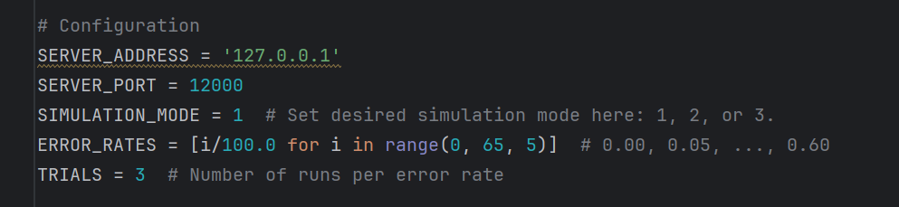
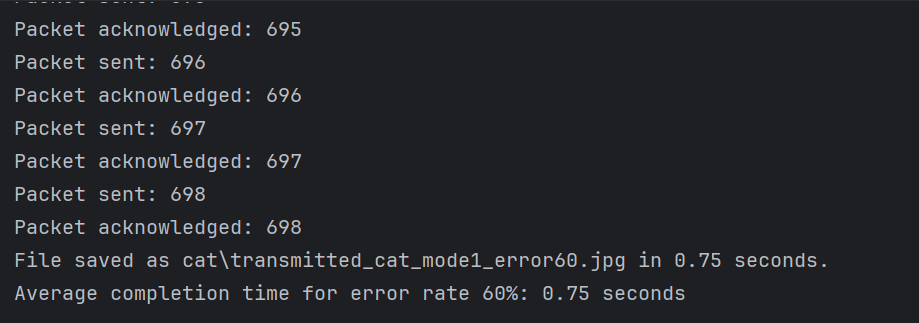
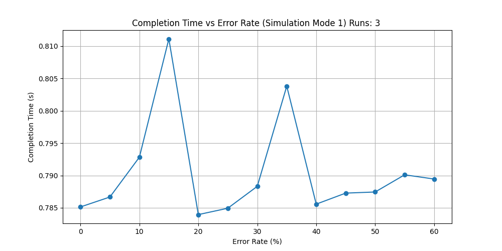
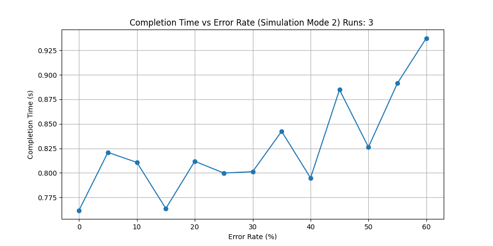

# Design File

---

### Title and Authors
* Phase 2
* Benjamin Dearden
* Michael Smith
* Peter Dingue
* Kathy Doan

### Purpose of The Phase
This phase's purpose is to implement rdt 2.2 on top of phase 1 rdt 1.0. The protocol provides reliable data transfer over an unreliable network with simulated errors.  

### Code Explanation
Client (v2_client.py): This script reads a file and splits it into packets, then implements a stop and wait arq with sequence numbers. It uses the send_packet function to send packets via the UDP. The client also handles ack bit errors by retransmitting packets if the acks for corrupted.

Server (v2_server.py): This script listens for packets on a UDP socket, then implements a checksum validation and sequcne number checking. It sends appropiate ack responses and reassmbles the recieved packets into the original file.

Helper functions (v2_udp_helps.py): This script implements a custom checksum function to detect errors in packets. The flip_bit() simulates bit errors by flipping a random bit in the data. The make_packet() creates a properly formatted UDP packet with a header containing sequence number and checksum. The send_packet() handles transmission logic including retransmission in the case of errors.

Test harness (harness.py): This script coordinates the testing process by running both the client and server with different error rates. Its creating a server in a spearate thread and then running the client to send files and collecting completing times and plotting performance charts.

rdt 2.2: This reliable data transfer 2.2 uses sequence numbers to detect duplicate packets and implements a checksum verification to detect corruption. It is using nak free retransmission meaning its only sending packets when needed.

Configuration settings for test harness

Console output with print statements turned on

Simulation plot for mode 1: No loss/bit-errors

Simulation plot for mode 2: ACK packet bit-error