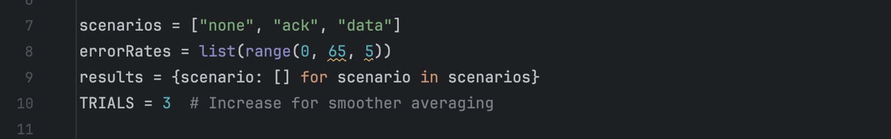
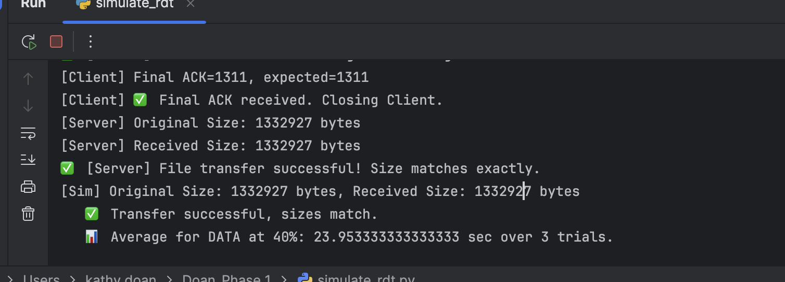
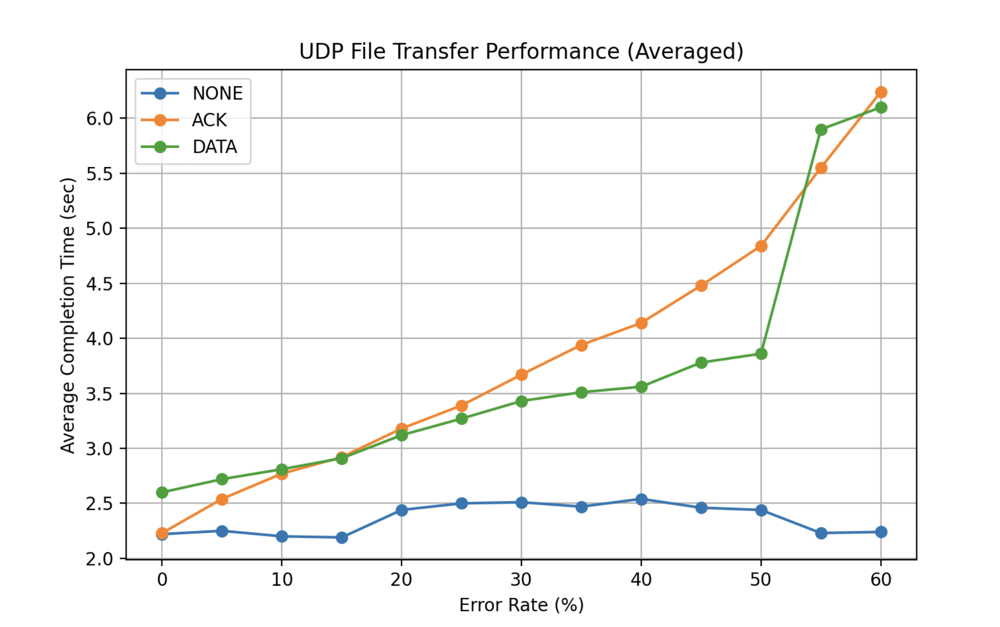

# Design File

---

### Title and Authors
* Phase 2
* Benjamin Dearden
* Michael Smith
* Peter Dingue
* Kathy Doan

### Purpose of The Phase
This phase's purpose is to implement rdt 2.2 on top of phase 1 rdt 1.0. The protocol provides reliable data transfer over an unreliable network with simulated errors (ACK and DATA corruption) using UDP, and a GUI for interacting with the simulation.

### Code Explanation
UDP_server.py: The server listens on a specified port, receives data packets, computes checksums to verify data integrity, and sends acknowledgments back to the client. It can inject errors into packets based on predefined rates to simulate data corruption or acknowledge corruption scenarios.

UDP_client.py: The client reads a file, segments it into packets, sends these to the server, and handles ACKs received from the server. It manages retransmissions if ACKs are not received within a timeout period, which simulates the behavior of reliable transmission protocols like TCP over the unreliable UDP.

simulate_rdt.py: This automates the testing of the UDP file transfer system by simulating different error rates and types over an unreliable network. It uses a test harness setup to measure how effectively the system manages reliable data transfer when faced with errors such as packet loss, ACK corruption, and data corruption.

tkinter_gui.py:  The GUI was designed using Tkinter and it provides an intuitive interface for starting the server and client, selecting error simulation types, and initiating the file transfer process. It consists of: Error Type Selection which allows the user to select between None, ACK Corruption, and DATA Corruption, a Start Server Button which initiates the server process, and a Start Client Button which begins the client process to send a file.

rdt 2.2: This reliable data transfer 2.2 uses sequence numbers to detect duplicate packets and implements a checksum verification to detect corruption. It is using nak free retransmission meaning its only sending packets when needed.

Configuration settings for test harness

Console output with print statements turned on

Simulation plot for all 3 modes: No loss/bit-errors, ACK packet bit-error, and Data packet bit-error
