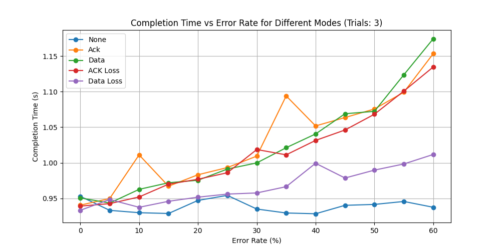

# Design File

---

### Title and Authors
* Phase 3
* Benjamin Dearden
* Michael Smith
* Peter Dingue
* Kathy Doan

### Purpose of The Phase
The purpose of this phase is to implement RDT 3.0 by modifying phase 2's  
RDT 2.2 by desensitizing the sender to irrelevant ACK messages and using timer's  
to trigger retransmission. 

### Code Explanation

Client (v3_client.py): This script reads a file and splits it into packets, then   
implements a stop and wait arq with sequence numbers. The client is desensitized  
to irrelevant ACK messages and relies on timeout to trigger packet retransmission.  
The client also simulates ACK packet bit error. 

Server (v3_server.py): This script listens for packets on a UDP socket. The packets  
are validated using checksum and sequence number, the server implements data packet loss  
by ignoring packets and sending previous ACK. The server also simulates Data packet bit error.  

Helper Functions (v3_udp_helpers.py): This script contains the useful functionality required  
by the client and server scripts. 

Pictured above is the completion time graph for all 5 simulations 
the code runs. The Data loss line   shows faster execution time
than the Data bit error line. This is likely due to data bit error 
retransmitting packets that still have bit errors. Whereas a lost packet 
can be retransmitted   after timing out and be successfully recieved 
with no data errors. Another factor that may have affect  
the shorter completion times for Data loss and not Data bit error are the 
recovery methods for when   a received packet is corrupted is the method
of recovery used within the code. The receiver needs to   check a packet 
to verify it contents are not corrupted whereas it does not need to check  
anything when it fails to receive a packet. In that case the sender never 
receives an ACK and   proceeds to resend the packet which can lead to packet 
loss taking less time to complete than   processing bit errors.

Pictured above is the average retransmissions for each error mode.

Pictured above is the throughput for each error mode in bytes per second
this graph correlates   with the first graph displaying completion times. 
The lines have inverse relations. The faster the completion time the less the
throughput declines as the error rate increases. 

## Discussion/Analysis
The code used to generate the previously displayed plots did not have a specified seed value.
  With each run comes some variance in the graphed plots. The source of this variance is not  
exactly clear. We have implemented a static seed value of 123 to generate two more sets of plots  
and the variance between the two runs is still visible. Shown below are the plotted results.

Run 1 Completion time above.

Run 1 Retransmission average above.

Run 1 Throughput in bytes per second above.

Run 2 Completion time above.

Run 2 Retransmission average above.

Run 2 Throughput in bytes per second above.

The one thing that remains consistent across these plotted graphs 
is the average number   of retransmissions. The completion 
time graph has difficult to explain anomalies in some of the  
modes where a higher percent error can result in a faster completion 
time. When the expected   behavior would be a slower completion time
as the error rate increases. We believe this may   be caused by 
the corruption implementations. Another potential factor causing this variance  
may be the machine the code is running on and the environmental factors that 
are not controllable. 

