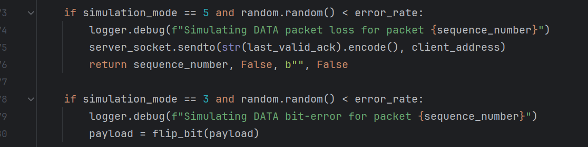

# Design File

---

### Title and Authors
* Phase 4
* Benjamin Dearden
* Michael Smith
* Peter Dingue
* Kathy Doan

### Purpose of The Phase
The purpose of this phase is to implement Go-Back-N protocol over an  
unreliable UDP channel. 

### Code Explanation
The python code for this project simulates Go-Back-N protocol by using a sliding window and  
cumulative ACKs to send packets from client to server. The server will send ACKs back to the client  
some of which can get lost. When an ACK is sent a timer begins and if an ACK is not received  
before a timeout an exception will be thrown causing all packets within the current window to be  
retransmitted. If an ACK is received after missing a few before the timer times out the previously  
missed ACKs are ignored because the ACKs are cumulative. All ACKs prior to the current one are  
recognized and the sender can continue to transmit the following packets. 

Above is the code that simulates data errors in the code to cause a packet to become corrupted at  
the sender.

Above is the code the simulates ACK errors to cause a packet ACK to get lost. An ACK bit error or  
ACK loss the result is the same. The ACK is not correct and if a higher ACK is not recieved before   
timeout a retransmission will occur. The simulated error results in the received ACK being lower than  
the expected ACK so that it does not result in a higher ACK clearing previously lost ACKs due to  
cumulative acknowledgement. These modes use a pseudo delay to simulate the extra processing required 
to recover from ACK loss. Which in Go-Back-N is very little thanks to cumulative ACK.

