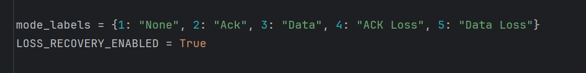

# ReadMe File

---

### Title and Authors
* Phase 4
* Benjamin Dearden
* Michael Smith
* Peter Dingue
* Kathy Doan

### Environment
* Windows 10/11
* Python
* Python 3.12
* PyCharm IDE 2024.1.1

### Instructions
1. install matplotlib (if you dont have this library yet)
2. Edit TRIALS to desired amount within v4_harness.py
3. run the test harness -- python v4_harness.py (this will test all error rates from 0% to 60% and generate the performance plots)
4. View output plot generated by v4_harness.py (three different performance plots are generated)
5. run the server -- python v4_server.py - Optional
6. run the client -- python v4_client.py - Optional
7.    Enable and Disable logging to console and log file by commenting the   logging.FileHandler(xx) and logging.StreamHandler() lines. This needs to be done   for each file. 
8.    Loss Recovery is enabled or disabled by changed the boolean value within the v4_harness.py and   the v4_client.py files.
