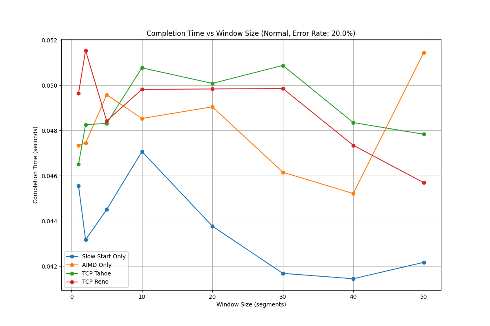

# Design File

---

### Title and Authors
* Phase 5
* Benjamin Dearden
* Michael Smith
* Peter Dingue
* Kathy Doan

### Purpose of The Phase
The purpose of this phase is to implement a simplified version of TCP using unreliable  
UDP sockets. The features implemented include: Connection setup and teardown, checksum implementation,  
Reliable data transfer (RDT), Timeout estimation and RTT calculation, and congestion control using standard  
TCP strategies. 

### Code Explanation

In the v5_client.py file this send file function is used to send 
the file from client to server. It includes arguments that get filled 
by the harness during testing for the appropriate simulation mode, error rate,
congestion protocol and the file to send. 

The two function above carry the information that the client sender uses. The harness runs the
run single transfer within a loop, within run single transfer the client and server are run using the
passed in arguments. Most of the heavy lifting for this project is within the harness script.

### CHART 1: TCP Performance with varying loss/error rate

Mode: No injected loss

Mode: ACK bit error

Mode: Packet bit error

Mode: ACK loss

Mode: Data loss

In the charts above the completion time vs error rate is shown for each congestion protocol one mode at a time. 
The almost unaffected modes 2 and 4 maintain speed close to that of no error because TCP uses cumulative ACK. 
A lost or corrupted ACK does not do much to reduce the completion time of the program. The spikes in the graph 
across the 5 modes, particularly 3 and 5 are likely that way because the dynamic window sizing and congestion 
control protocols are more efficient at specific error rates. 

### CHART 2: Completion time vs timeout value

Mode: No injected loss

Mode: ACK bit error

Mode: Packet bit error

Mode: ACK loss

Mode: Data loss

In these plots showing the effect timeout value has on completion time we see
a significant level of variance across the different congestion protocols and modes. 
The most significant contributor to completion time is the error mode itself and less 
so the congestion control protocol. This is likely due to the very small window that 
a packet is being transmitted. The short time spent in transit means there is not a 
great difference in completion time due to increased or decreased timeout value.

### CHART 3: Completion time vs window size

No injected loss 

Mode: ACK bit error

Mode: Packet bit error 

Mode: ACK loss

Mode: Data Loss

### CHART 4: Protocol performance comparison

In the graph above we see the performance of each congestion protocol compared 
for each error scenario. Modes 1, 2, and 4 suffer the least losses due to the 
way TCP handles ACK's cumulatively in general. The two data loss modes, 3 and 5 suffer the most
performance losses. The congestion control protocols each result in similar performance with Reno 
outperforming the rest in data bit error (mode 3) and Tahoe slightly outperforming the rest in data
loss (mode 5).

### Additional Charts

The next 5 plots display for each mode the change in transmission time in the congestion window size at a
fixed 20% error across the 5 different error modes.These plots show the window growing until it reaches 
saturation where the transmission is steadily flowing. Some of these are effected by very frequent failure 
and retransmission which causes the window to go back to 1 and results in a graph that looks like a square function.

Here is a sample RTT vs time showing the increase in return time as it stabilizes and drops to nothing 
once the transmission is over.

